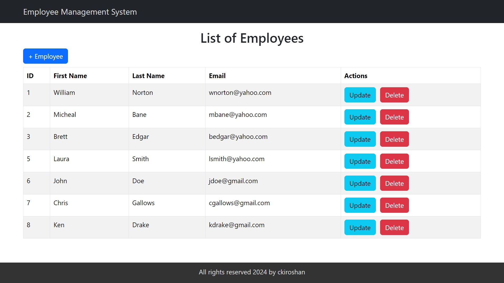

# Employee Management System

This is a full-stack **Employee Management System** built using **React** for the front-end and **Spring Boot** for the back-end. The application allows users to add, update, list, and delete employee details.




## Features

- View a list of employees
- Add new employees
- Update existing employees
- Delete employees
- Form validation on employee creation and updates

## Frontend

The front-end is built with **React**. It provides a user-friendly interface for managing employees. It uses **Axios** to communicate with the back-end API.

### Key Technologies

- React
- React Router
- Axios
- Bootstrap for styling

### Components

- **ListEmployeeComponent**: Displays the list of employees, allows adding new employees, updating existing employees, and deleting employees.
- **EmployeeComponent**: A form for adding or updating employee information with validation.

## Backend

The back-end is built with **Spring Boot**. It exposes RESTful APIs for employee management that the React front-end interacts with. The database interaction is handled using **JPA** and **MySQL**.

### Key Technologies

- Spring Boot
- Spring Data JPA
- MySQL

### API Endpoints

- `GET /api/employees`: Retrieve a list of all employees.
- `POST /api/employees`: Add a new employee.
- `GET /api/employees/{id}`: Get a single employee by ID.
- `PUT /api/employees/{id}`: Update an employee by ID.
- `DELETE /api/employees/{id}`: Delete an employee by ID.

## Project Structure

```
employee-management-system/
│
├── frontend/           # React frontend application
│   ├── public/
│   ├── src/
│   ├── package.json
│   └── ...
│
├── backend/            # Spring Boot backend application
│   ├── src/
│   ├── pom.xml
│   └── ...
└── README.md
```

## How to Use

1. Start the Spring Boot application by running it in your IDE or through the terminal.
2. Run the React application.
3. Access the employee management system by navigating to `http://localhost:3000` in your browser.
4. You can now view, add, update, and delete employee records.

## Contributing

Contributions are welcome! Feel free to open an issue or submit a pull request for any bug fixes or enhancements.

## License

This project is licensed under the MIT License - see the [LICENSE](LICENSE) file for details.
